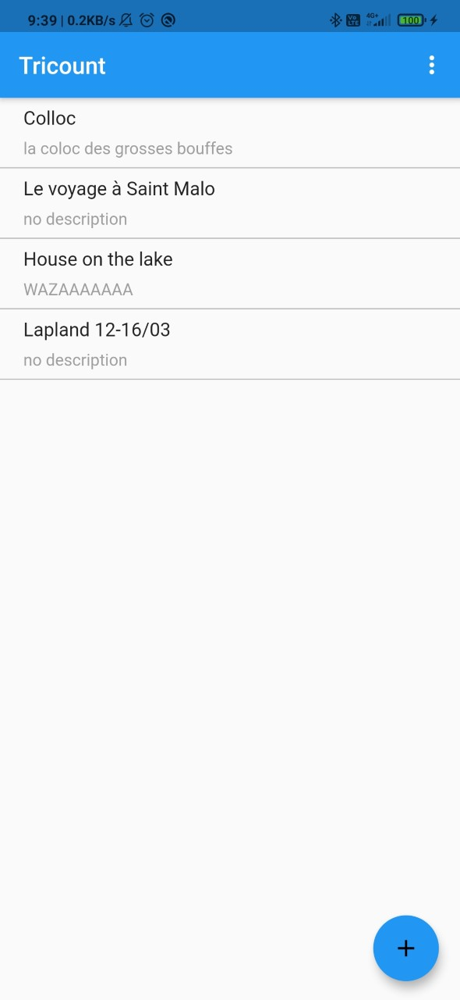
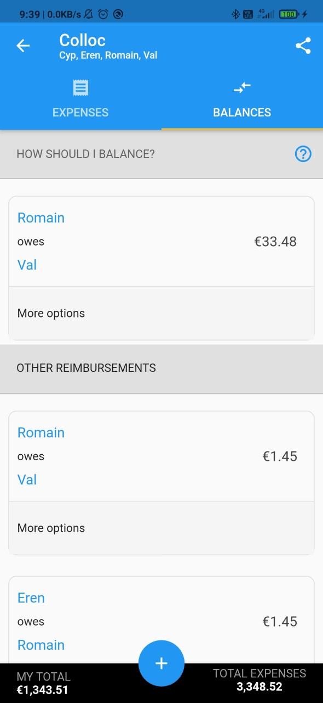

# tricount_flutter

A UI recreation of Tricount made in Flutter.
This was my step back in Flutter developpement, and a good exercice.

I still need to implement Firebase and the backend.

Maybe it's the opportunity for me to try BLoC architecture.

  
   
   
   

